1. Instalasi Laravel 11:
   Pastikan sudah terinstal PHP, Composer, dan MySQL.
   Instal Laravel:
   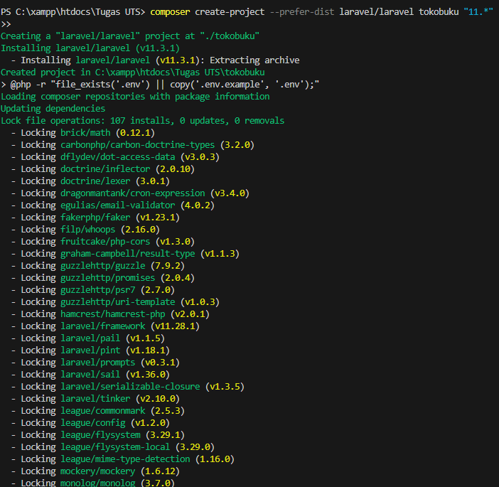

   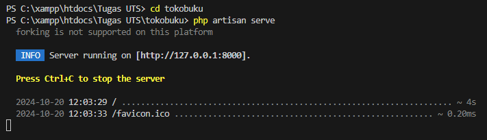

   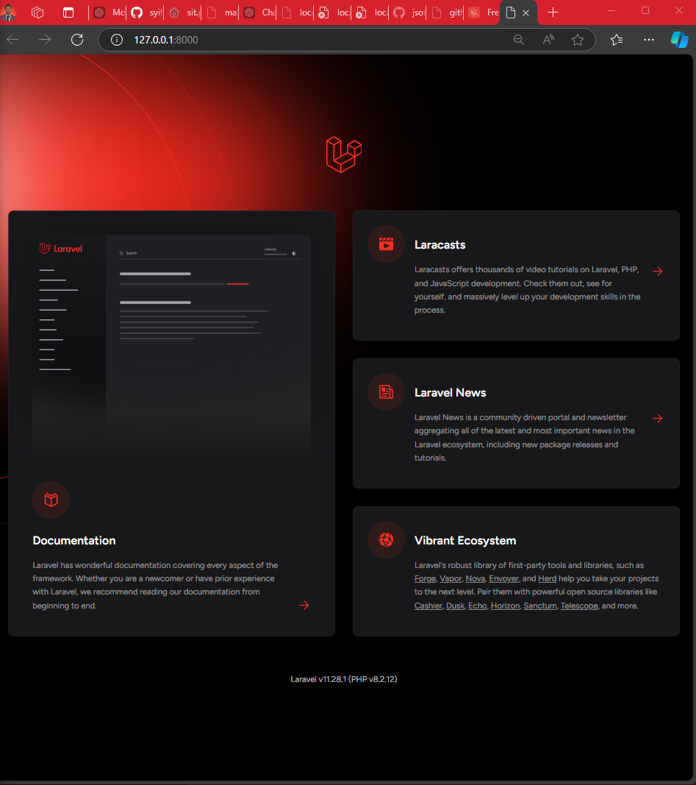

2. Konfigurasi Database:
   Buat database MySQL baru bernama 'tokobuku_db'.
   Sesuaikan file .env dengan informasi berikut:

   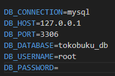

3. Migrasi Awal:
   Jalankan perintah berikut untuk membuat tabel default:

   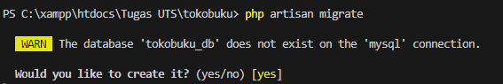

4. Membuat Migration dan Model
   Buat migration dan model untuk Kategori dan Buku:

   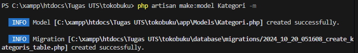

    Edit file migration `create_kategoris_table.php`:

   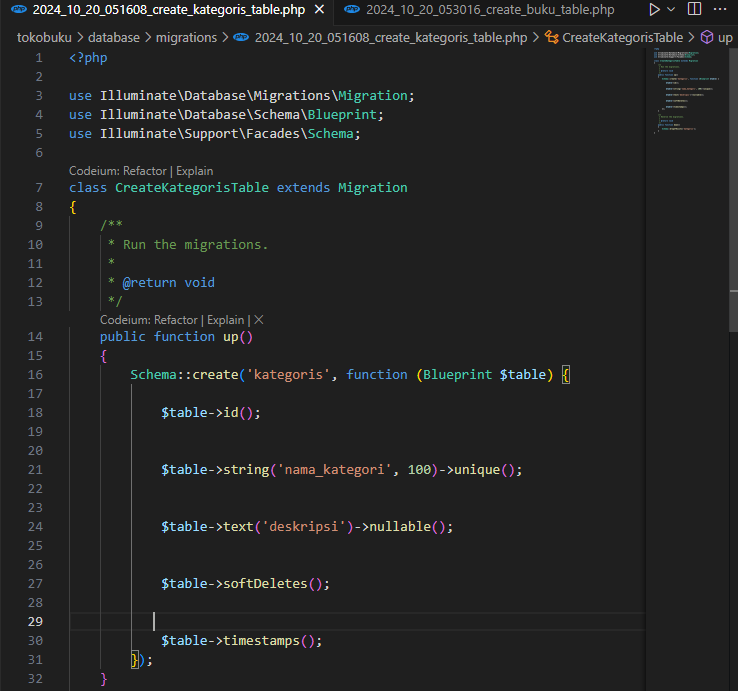

    Edit file migration `create_bukus_table.php`
   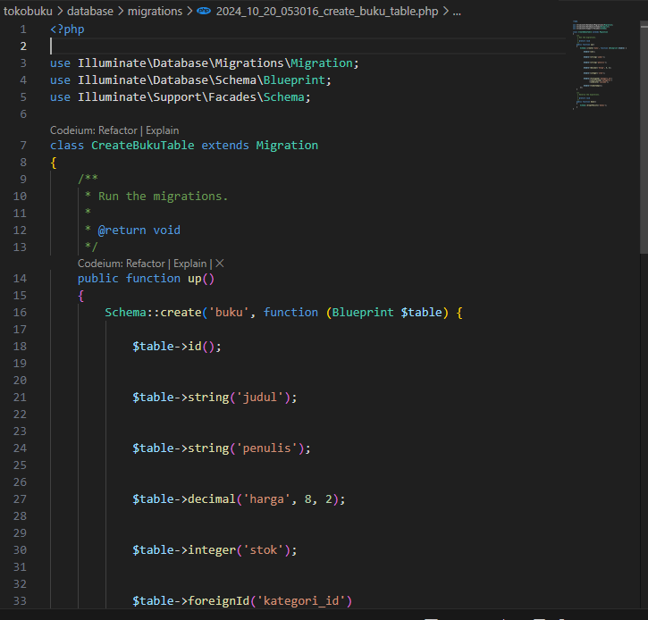

 5. Membuat Controller API untuk Kategori dan Buku
  Buat controller untuk Kategori dan Buku:
  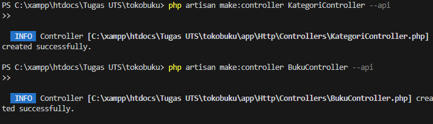

  Isi file `KategoriController.php`:
  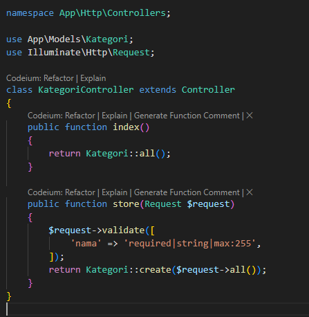

  Testing API dengan Postman
  Jalankan server Laravel:
  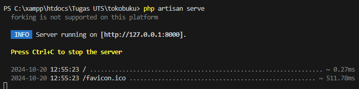

  

